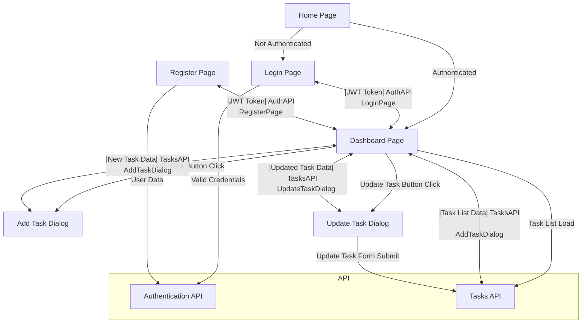

# Doit frontend

A clean and modern frontend application for a task managment.

## Description

This is a frontend application for a task manager built with Next.js, TypeScript and Tailwind CSS. The application provides a user interface to register and authenticate users, as well as to manage tasks (create, read, update, and delete).

## System Design

The application follows a component architecture, with each component responsible for a specific part of the user interface.

-   Components: Individual UI elements, such as buttons, forms, and tables.
-   Routes: In Next.js 13 and above, routes are defined inside the `app` directory. Each route corresponds to a specific page or component.
-   Actions: Functions that handle user interactions and update the application state.

## Project Structure

```bash
app/
|-- actions/
|   |-- auth.ts            # Authentication actions
|   |-- tasks.ts           # Task management actions
|-- (auth)/
|   |-- login/             # Login page
|   |-- register/          # Register page
|-- dashboard/             # Dashboard page
|-- api/
|   |-- auth/              # Authentication API routes
|       |-- [...nextauth]/  # NextAuth.js handler
|-- components/
|   |-- auth/
|   |   |-- login-form.tsx # Login form component
|   |   |-- register-form.tsx # Register form component
|   |   |-- with-auth.tsx  # Higher-order component for authentication
|   |-- task/
|   |   |-- add-task-button.tsx # Add task button component
|   |   |-- add-task-dialog.tsx # Add task dialog component
|   |   |-- task-filter.tsx   # Task filter component
|   |   |-- task-list.tsx    # Task list component
|   |   |-- task.tsx         # Task component
|   |   |-- update-task-dialog.tsx # Update task dialog component
|   |-- ui/
|       |-- button.tsx       # Button component
|       |-- dialog.tsx       # Dialog component
|       |-- input.tsx        # Input component
|       |-- select.tsx       # Select component
|       |-- skeleton.tsx     # Skeleton loader component
|       |-- textarea.tsx     # Textarea component
|       |-- toast.tsx        # Toast notification component
|-- hooks/
|   |-- useTaskStore.ts    # Custom hook for task store
|-- layout.tsx             # Global layout component
|-- page.tsx               # Home page

```

## Application Pages

-   `/`: Home page that redirects to the login page if the user is not authenticated, or to the dashboard page if the user is authenticated.
-   `/login`: Login page that allows users to authenticate with their email and password.
-   `/register`: Register page that allows users to create a new account with their username, email, and password.
-   `/dashboard`: Dashboard page that displays the user's tasks and allows them to manage them.

## Application State

The application state is managed using Zustand. The task store contains the following state:

-   `tasks`: An array of tasks.
-   `isLoading`: A boolean flag indicating whether the tasks are being loaded.
-   `error`: An error object if an error occurs while loading the tasks.
-   `filterStatus`: A string indicating the current filter status.

The task store provides the following methods:

-   `fetchTasks`: A function for fetching tasks from the API.
-   `addTask`: A function for adding a new task to the API.
-   `deleteTask`: A function for deleting a task from the API.
-   `updateTask`: A function for updating a task in the API.
-   `setFilterStatus`: A function for setting the current filter status.

## API Endpoints

The application uses the following API endpoints:

-   `/api/auth/register`: Register a new user.
-   `/api/auth/login`: Authenticate a user and get a JWT token.
-   `/api/tasks`: Get all tasks of the authenticated user.
-   `/api/tasks`: Create a new task.
-   `/api/tasks/:id`: Update a task.
-   `/api/tasks/:id`: Delete a task.

## Frontend Logic Explained

1. While not authenticated, the user is redirected to the login page.
2. When the user is authenticated, they are redirected to the dashboard page.
3. Upon clicking the "sign up" button, the user is redirected to the register page. upon successful registration, the user is redirected to the login page.
4. Upon entring the dashboard page, the user is presented with a list of tasks. if there are no tasks, a message is displayed.
5. Upon clicking the "add task" button, a dialog is displayed with an input field for the task name and a textarea for the task description. upon clicking the "add task" button, the task is added to the list of tasks and is immediately displayed in the dashboard.
6. The tasks are automatically sorted by the set priority. i.e., the In Progress tasks are displayed first, followed by the Pending tasks, and then the Completed tasks.
7. Upon clicking a task, it's shifted to the right and two buttons are displayed: "update task" and "delete task".
8. To Do

## Flow Diagram



## How to run the application

1. Install dependencies using `npm install`
2. Set up the environment variables in a `.env.local` file in the root directory
3. Run the application using `npm run dev`
4. Open [http://localhost:3000](http://localhost:3000) with your browser to see the result.
